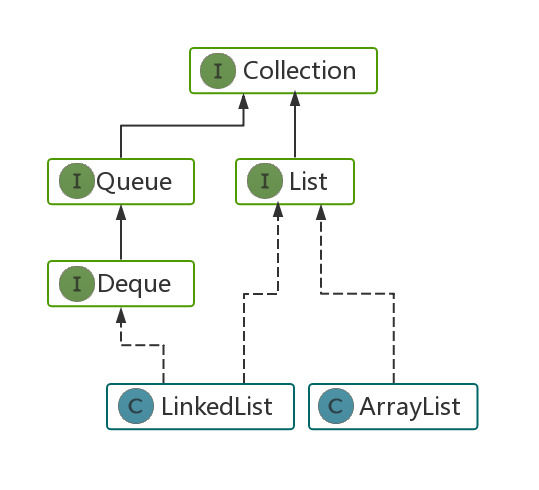
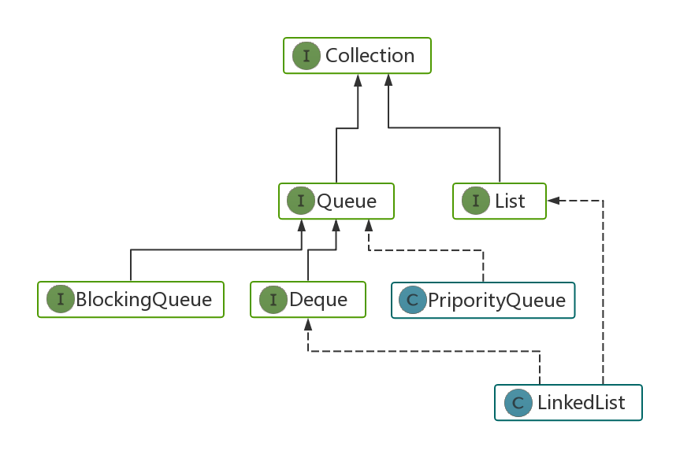
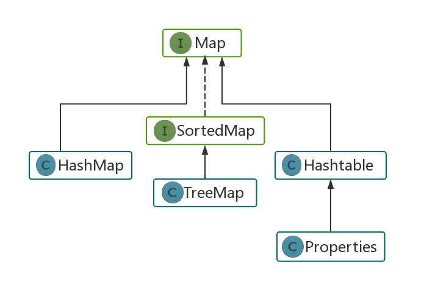

# 1. 数组
## 1.1 数组特性
>数组是一种线性表结构，它用一组**连续的内存空间**，来存储**相同类型**的数据。

Java中数组的定义：

(1) `int[] list = new int[10];` # 固定大小

(2) `List<Integer> list = new ArrayList<>();` # 支持动态扩容



List类常用的方法：
1. .add(num) & .addAll( {num1,num2} )  //添加元素
2. .remove(num) & .removeAll( {num1,num2} )  //移除元素
3. .contains(num) & .containsll( {num1,num2} )  //包含元素
4. .size()  //大小
5. .toArray() //转数组

## 1.2 相关LC题目
- 数组+双指针：
  - [11.盛最多水的容器](https://leetcode-cn.com/problems/container-with-most-water) 
  - [15.三数之和](https://leetcode-cn.com/problems/3sum) 
- 数组+原地删改：
  - [26.删除排序数组中的重复项](https://leetcode-cn.com/problems/remove-duplicates-from-sorted-array) ：快慢双指针
  - [27.移除元素](https://leetcode-cn.com/problems/remove-element) ：快慢双指针
  - [31.下一个排列](https://leetcode-cn.com/problems/next-permutation) ：临界条件
- 数组+二分查找：
  - [33.搜索旋转排序数组](https://leetcode-cn.com/problems/search-in-rotated-sorted-array/)：三条件组合判断
  - [34.在排序数组中查找元素的第一个和最后一个位置](https://leetcode-cn.com/problems/find-first-and-last-position-of-element-in-sorted-array/)：二分+遍历

# 2. 链表
## 2.1 链表特性
>常用的链表有：单链表、双向链表、循环链表

Java中链表的定义：

(1) 自己定义：
```java
class ListNode{
    int val;
    ListNode next;
    ListNode(int x) { val = x; }
}
```

(2) `LinkedList<Integer> linkedList = new LinkedList<>();` # 双向链表


## 2.2 相关LC题目
- 删除操作
  - [19.删除链表的倒数第N个节点](https://leetcode-cn.com/problems/remove-nth-node-from-end-of-list/) ：链表+哈希表
  - [82.删除排序链表中的重复元素 II](https://leetcode-cn.com/problems/remove-duplicates-from-sorted-list-ii/)：链表+递归

- 交换操作
  - [24.两两交换链表中的节点](https://leetcode-cn.com/problems/swap-nodes-in-pairs/description/)：链表+递归
  - [25.K个一组翻转链表](https://leetcode-cn.com/problems/reverse-nodes-in-k-group/description/)：链表+递归+反转
  - [61.旋转链表(右旋n步)](https://leetcode-cn.com/problems/rotate-list/description/)
  - [92.反转链表(m->n)](https://leetcode-cn.com/problems/reverse-linked-list-ii/description/])：链表+多指针

- 链表排序
    - [143.重排链表](https://leetcode-cn.com/problems/reorder-list/description/)：拆分+反转+合并
    - [147.对链表进行插入排序](https://leetcode-cn.com/problems/insertion-sort-list/description/)：依次插入
    - [148.排序链表](https://leetcode-cn.com/problems/sort-list/description/)：快慢双指针+归并排序

# 3. 栈
## 3.1 Java中的Stack类

如图所示，Stack来自于Vector，那么显然Stack的底层实现是数组。


属于stack自己的方法包括：
 1. .push(num) //入栈
 2. .pop() //栈顶元素出栈
 3. .isEmpty() //判定栈是否为空
 4. .peek() //获取栈顶元素
 5. .search(num) //判端元素num是否在栈中

## 3.2 相关LC题目
- 面积问题
    - [42.接雨水](https://leetcode-cn.com/problems/trapping-rain-water/description/)：常规做法-双指针；栈做法-墙入栈
    - [84.柱状图中的最大矩形](https://leetcode-cn.com/problems/largest-rectangle-in-histogram/description/)：栈头预压入-1，栈中存放升序列
    - [85.最大矩形](https://leetcode-cn.com/problems/maximal-rectangle/description/)：84题的矩阵形式
- 字符串问题
    - [20.有效的括号](https://leetcode-cn.com/problems/valid-parentheses/description/)：栈基础问题
    - [71.简化路径](https://leetcode-cn.com/problems/simplify-path/description/)：路径的情况分析 + 栈存结果
    - [316.去除重复字母](https://leetcode-cn.com/problems/remove-duplicate-letters/description/)：使用26字母的计数表来判断后面是否还有该字母 + 栈存储结果
- 二叉树遍历
    - [94.二叉树的中序遍历](https://leetcode-cn.com/problems/binary-tree-inorder-traversal/description/)：判断右节点来出栈
    - [144.二叉树的前序遍历](https://leetcode-cn.com/problems/binary-tree-preorder-traversal/description/)：栈存右节点
    - [145.二叉树的后序遍历](https://leetcode-cn.com/problems/binary-tree-postorder-traversal/description/)：通过linkedlist从上往右一边入栈，一边往list中addFirst加值；为空时再往左

# 4. 队列
## 4.1 Java中的Queue类
常用的有双端队列 Deque, 优先队列 PriporityQueue, 双向链表 LinkedList, 阻塞队列 BlockingQueue:



Queue的方法有：
1. .add(num) = .offer(num)  //添加元素
2. .poll() = .remove()  //移除并返回头部
3. .peek() = .element() // 返回队列头部的元素
4. .put()  //阻塞队列添加元素，如果队列满，则阻塞
5. .take() //阻塞队列移除元素并返回头部，如果队列为空，则阻塞

## 4.2 相关LC题目
- 栈和队列的转换
   - [225.用队列实现栈](https://leetcode-cn.com/problems/implement-stack-using-queues/description/)：进出双队列实现 or 单队列
   - [232.用栈实现队列](https://leetcode-cn.com/problems/implement-queue-using-stacks/description/)
- 利用优先队列进行排序
   - [23.合并K个排序链表](https://leetcode-cn.com/problems/merge-k-sorted-lists/description/)：建立链表结点的优先队列
   - [56.合并区间](https://leetcode-cn.com/problems/merge-intervals/description/)：利用comparator来排序
   - [435.无重叠区间](https://leetcode-cn.com/problems/non-overlapping-intervals/description/)：判断每个区间的尾部
   - [692.前k个高频词](https://leetcode-cn.com/problems/top-k-frequent-words/description/)：哈希表+优先队列


# 5. 哈希表
## 5.1 Java中的Map类



Map 类没有继承Collection接口，提供key-value键值对映射。

**常用子类**
- HashMap：内部结构为哈希表+红黑树，异步处理（线程不安全），K和V都允许为null；
- Hashtable：内部结构为哈希表，同步（性能低），K和V都不允许为null；
- TreeMap：基于红黑树，异步处理，K不允许为null，K有序；

**常用方法**

- .containsKey(x)：是否含有key - O(1)
- .containsValue(x)：是否含有value - O(n)
- .get(key)： 获取key对应的值
- .put(key, value)：放入k-v
- .remove(key)：删除k-v
- .clear()：清空
- .keySet()：获取key的Set集合
- .values()：获取value的Collection集合
- Entry<K,V>：一个k-v对
- .entrySet()：k-v对的Set集合

## 5.2 相关LC题目
- 空间换时间
  - [1. 两数之和](https://leetcode-cn.com/problems/two-sum/description/)：哈希表 + 单次循环
  - [274. H指数](https://leetcode-cn.com/problems/h-index/description/)

- 哈希表记录下标
  - [3. 无重复字符的最长子串](https://leetcode-cn.com/problems/longest-substring-without-repeating-characters/description/)：哈希表 + 滑动窗口
  - [202. 快乐数](https://leetcode-cn.com/problems/happy-number/description/)

- 哈希表记录频次
  - [30. 串联所有单词的子串](https://leetcode-cn.com/problems/substring-with-concatenation-of-all-words/description/)：哈希表统计单词表次数 + 滑动双指针
  - [187. 重复的DNA序列](https://leetcode-cn.com/problems/repeated-dna-sequences/description/)


# 6. 排序