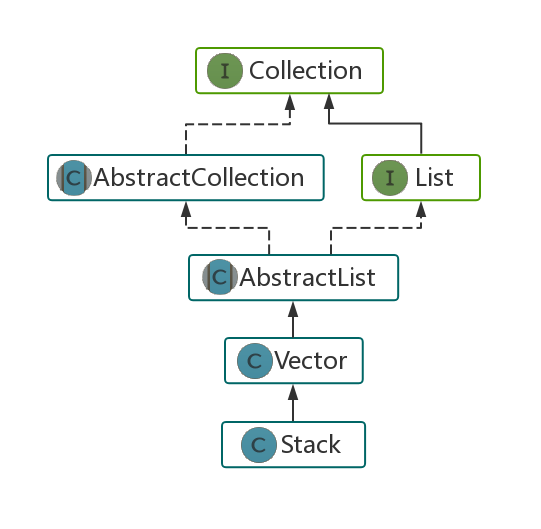

# 1. 数组
## 1.1 数组特性
>数组是一种线性表结构，它用一组**连续的内存空间**，来存储**相同类型**的数据。

Java中数组的定义：

(1) `int[] list = new int[10];` # 固定大小

(2) `List<Integer> list = new ArrayList<>();` # 支持动态扩容

## 1.2 数组题型
- 数组+双指针：
  - [11.盛最多水的容器](https://leetcode-cn.com/problems/container-with-most-water) 
  - [15.三数之和](https://leetcode-cn.com/problems/3sum) 
- 数组+原地删改：
  - [26.删除排序数组中的重复项](https://leetcode-cn.com/problems/remove-duplicates-from-sorted-array) ：快慢双指针
  - [27.移除元素](https://leetcode-cn.com/problems/remove-element) ：快慢双指针
  - [31.下一个排列](https://leetcode-cn.com/problems/next-permutation) ：临界条件
- 数组+二分查找：
  - [33.搜索旋转排序数组](https://leetcode-cn.com/problems/search-in-rotated-sorted-array/)：三条件组合判断
  - [34.在排序数组中查找元素的第一个和最后一个位置](https://leetcode-cn.com/problems/find-first-and-last-position-of-element-in-sorted-array/)：二分+遍历

# 2. 链表
## 2.1 链表特性
>常用的链表有：单链表、双向链表、循环链表

Java中链表的定义：

(1) 自己定义：
```java
class ListNode{
    int val;
    ListNode next;
    ListNode(int x) { val = x; }
}
```

(2) `LinkedList<Integer> linkedList = new LinkedList<>();` # 双向链表

## 2.2 链表题型
- 删除操作
  - [19.删除链表的倒数第N个节点](https://leetcode-cn.com/problems/remove-nth-node-from-end-of-list/) ：链表+哈希表
  - [82.删除排序链表中的重复元素 II](https://leetcode-cn.com/problems/remove-duplicates-from-sorted-list-ii/)：链表+递归

- 交换操作
  - [24.两两交换链表中的节点](https://leetcode-cn.com/problems/swap-nodes-in-pairs/description/)：链表+递归
  - [25.K个一组翻转链表](https://leetcode-cn.com/problems/reverse-nodes-in-k-group/description/)：链表+递归+反转
  - [61.旋转链表(右旋n步)](https://leetcode-cn.com/problems/rotate-list/description/)
  - [92.反转链表(m->n)](https://leetcode-cn.com/problems/reverse-linked-list-ii/description/])：链表+多指针

- 链表排序
    - [143.重排链表](https://leetcode-cn.com/problems/reorder-list/description/)：拆分+反转+合并
    - [147.对链表进行插入排序](https://leetcode-cn.com/problems/insertion-sort-list/description/)：依次插入
    - [148.排序链表](https://leetcode-cn.com/problems/sort-list/description/)：快慢双指针+归并排序

# 3. 栈
## 3.1 Java中的Stack类

如图所示，Stack来自于Vector，那么显然Stack的底层实现是数组。



属于stack自己的方法包括：
 1. push(num) //入栈
 2. pop() //栈顶元素出栈
 3. empty() //判定栈是否为空
 4. peek() //获取栈顶元素
 5. search(num) //判端元素num是否在栈中

## 3.2 相关LC题目
- 面积问题
    - [42.接雨水](https://leetcode-cn.com/problems/trapping-rain-water/description/)：常规做法-双指针；栈做法-墙入栈
    - [84.柱状图中的最大矩形](https://leetcode-cn.com/problems/largest-rectangle-in-histogram/description/)：栈头预压入-1，栈中存放升序列
    - [85.最大矩形](https://leetcode-cn.com/problems/maximal-rectangle/description/)：84题的矩阵形式
- 字符串问题
    - [20.有效的括号]()
    - [71.简化路径]()
    - [216.去除重复字母]()
- 二叉树遍历
    - [94.二叉树的中序遍历]()
    - [144.二叉树的前序遍历]()
    - [145.二叉树的后序遍历]()

